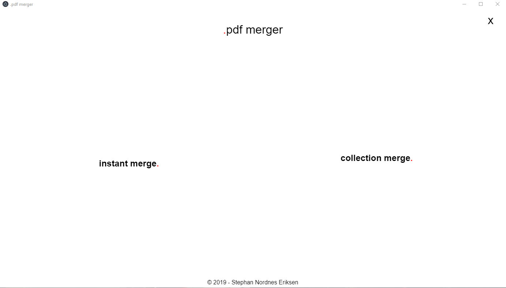
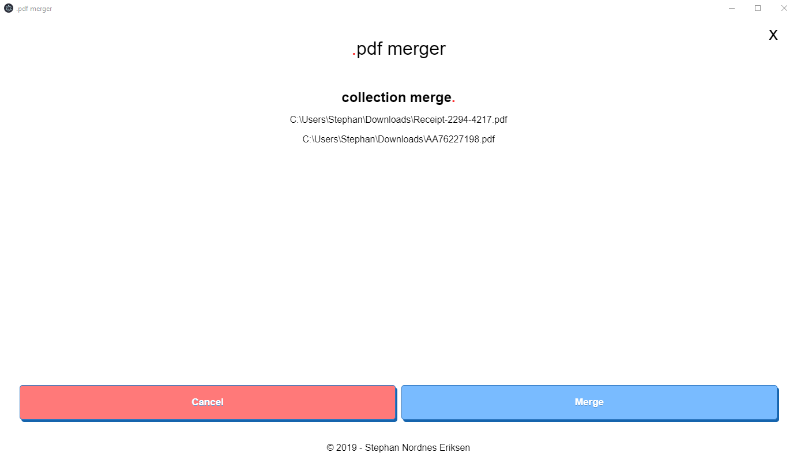

# pdf-merger
Simple Cross platform PDF merger gui. Should work on most platforms (Windows, Linux, MacOS).

Drag-n-drop pdf-files to merge them into one. Drop multiple files into the the `Instant Merge.` to immediately merge all the dropped PDF-files. Drop one or more PDFs into the collection merge to make a collection. Repeat the process, and finally click "merge" to merge all the files in the order that they were dropped in.

# License
[MIT](./LICENSE)

# [TODO](./TODO)
There are still many things left to do in this project, but hopefully this already has some value. Please feel free to report issues, and contribute if you can!
