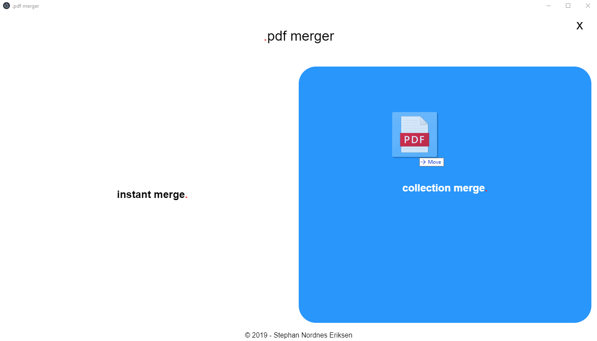

# PDF Merger
Simple Cross platform PDF merger gui. Should work on most platforms (Windows, Linux, MacOS).

Drag-n-drop PDF files to merge them into one. Drop multiple files into the the `instant merge.` to immediately merge all the dropped PDF-files. Drop one or more PDF files into the `collection merge.` to make a collection. Drop more files until you have collected all, and finally click "merge" to merge all the files in the order that they were dropped in.

# Download
Go to the [releases](https://github.com/stephan-nordnes-eriksen/pdf-merger/releases) tab to get the latest version for your platform.

# Build
To build and run yourself, do the following
1. Clone/Download repo (eg. Run `git clone https://github.com/stephan-nordnes-eriksen/pdf-merger.git`)
2. Open folder in terminal. Run `cd pdf-merger`
3. Npm install. Run `npm i`
4. Start project. Run `npm run start`
5. (Optional) Build installer. Run `npm run pack`

# Interface

# License
[MIT](./LICENSE)

# [TODO](./TODO)
There are still many things left to do in this project, but hopefully this already has some value. Please feel free to report issues, and contribute if you can!
